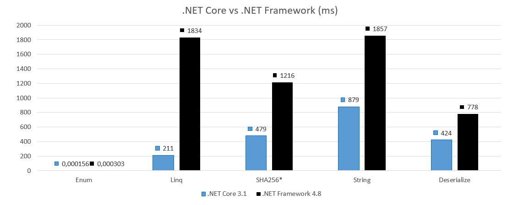

# DotNetFrameworkVsCore
Code to compare performance of .NET Framework (4.8) and .NET Core (3.1.1)



### Enum:
```csharp
public DayOfWeek EnumParse() => (DayOfWeek)Enum.Parse(typeof(DayOfWeek), "Thursday");
```

### Linq:
```csharp
public void LinqOrderBySkipFirst() => _tenMillionToZero.OrderBy(i => i).Skip(4).First();
```

### SHA256:
```csharp
public void Sha256() => _sha256.ComputeHash(_raw);
```

### String:
```csharp
public void StringStartsWith()
{
    for (int i = 0; i < 100_000_000; i++)
    {
        _s.StartsWith("abcdefghijklmnopqrstuvwxy-", StringComparison.Ordinal);
    }
}
```

### Deserialize:
```csharp
public void Deserialize()
{
    var books = new List<Book>();
    for (int i = 0; i < 1_00000; i++)
    {
        string id = i.ToString();
        books.Add(new Book { Name = id, Id = id });
    }

    var formatter = new BinaryFormatter();
    var mem = new MemoryStream();
    formatter.Serialize(mem, books);
    mem.Position = 0;

    formatter.Deserialize(mem);
}
```

## Results

### Intel  Core i7-4702MQ CPU 2.20GHz (Hasewell), Windows 10 (1909)
#### .NET Framework 4.8
- Enum -  303 ns
- Linq - 1 834 ms
- SHA256 - 1 216 ms
- String - 1 857 ms
- Deserialize - 778 ms
#### .NET Core 3.1.1
- Enum -  156 ns
- Linq - 211 ms
- SHA256 - 479 ms
- String - 879 ms
- Deserialize - 424 ms

### AMD Ryzen 7 3700X, Windows 10 (1903 (?))
#### .NET Framework 4.8
- Enum -  231 ns
- Linq - 1 283 ms
- SHA256 - 687 ms
- String - 1 279 ms
- Deserialize - 645 ms
#### .NET Core 3.1.1
- Enum -  129 ns
- Linq - 158 ms
- SHA256 - 49 ms
- String - 444 ms
- Deserialize - 305 ms