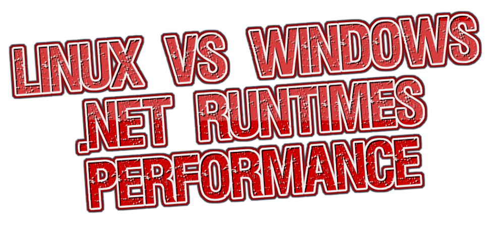

# DotNetFrameworkVsCore - compare multiple .NET runtimes on various OS
Small console application to compare performance of **.NET Framework (4.8), .NET Core (3.1.x), .NET 5 and Mono (6.8.0)**.

Common tests are written in .NET Standard. App contains 5 benchmarks to test performance of .NET Framework (4.8), .NET Core (3.1.x), .NET 5, .NET 6 and Mono (6.8.0). Another 4 benchmarks are related to regex performance. FileStream tests present huge performance boost for file streaming in .NET 6. Results taken by [BenchmarkDotNet](https://benchmarkdotnet.org/).

 You can easily  check how fast/slow is .NET Framework/.NET Core/.NET 5(6)/Mono. But we can do more. .NET Core, .NET 5, 6 and Mono are **multi-platform runtimes**. It's very easy now to compare various .NET platform on **Windows and Linux**.

# Code details

DotNetFrameworkVsCore contains multiple test to compare .NET performance. Each of method can be run on .NET Framework, .NET Core, .NET 5, .NET 6,  Mono and are fully compatible with Windows and Linux (should also run on MacOS).

### Enum:
```csharp
public DayOfWeek EnumParse() => (DayOfWeek)Enum.Parse(typeof(DayOfWeek), "Thursday");
```

### Linq:
```csharp
//IEnumerable<int> _tenMillionToZero = Enumerable.Range(0, 10_000_000).Reverse();

public int LinqOrderBySkipFirst() => _tenMillionToZero.OrderBy(i => i).Skip(4).First();
```

### SHA256:
```csharp
//byte[] _raw = new byte[100 * 1024 * 1024];
//for (int index = 0; index < _raw.Length; index++) _raw[index] = (byte)index;

public byte[] Sha256() => _sha256.ComputeHash(_raw);
```

### String:
```csharp
// static string _s = "abcdefghijklmnopqrstuvwxyz";

public bool StringStartsWith()
{
    var data = false;
    for (int i = 0; i < 100_000_000; i++)
    {
        data = _s.StartsWith("abcdefghijklmnopqrstuvwxy-", StringComparison.Ordinal);
    }
    return data;
}
```

### Deserialize:
```csharp

//var _books = new List<Book>();
//for (int i = 0; i < 1_00000; i++)
//{
//    string id = i.ToString();
//    _books.Add(new Book { Name = id, Id = id });
//}
    
public object Deserialize()
{    
    var formatter = new BinaryFormatter();
    var mem = new MemoryStream();
    formatter.Serialize(mem, _books);
    mem.Position = 0;

    return formatter.Deserialize(mem);
}
```

### Regex:

Input data is generated on  setup by merging multiple Guid strings.

#### Email:

```csharp
_regexEmail = new Regex(@"[a-z0-9!#$%&'*+/=?^_`{|}~-]+(?:\.[a-z0-9!#$%&'*+/=?^_`{|}~-]+)*@(?:[a-z0-9](?:[a-z0-9-]*[a-z0-9])?\.)+[a-z0-9](?:[a-z0-9-]*[a-z0-9])?", RegexOptions.Compiled);

 _regexEmail.IsMatch(_commonInput);
```

#### Strong password:

```csharp
_regexStrongPassword = new Regex(@"^(?=.*\d)(?=.*[a-z])(?=.*[A-Z])(?=.*[a-zA-Z]).{8,}$", RegexOptions.Compiled);

_regexStrongPassword.IsMatch(_commonInput);
```

#### Span-based searching with Vectorized Methods:

```csharp
_regexSpanSearching = new Regex("([ab]cd|ef[g-i])jklm", RegexOptions.Compiled);

_regexSpanSearching.IsMatch(_commonInput);
```

#### Backtracking elimination:

```csharp
_regexBackTracking = new Regex("a*a*a*a*a*a*a*b", RegexOptions.Compiled);;

_regexBackTracking.IsMatch("aaaaaaaaaaaaaaaaaaaaa");
```

### File Stream:


#### Read:

```csharp
using (var fileStream = new FileStream(_fileName, FileMode.Open, FileAccess.Read, FileShare.Read, bufferSize: 4096, useAsync: true))
{
    while (await fileStream.ReadAsync(_buffer, 0, _buffer.Length) > 0)
    {
    }
}
```

#### Write:

```csharp
using (var fileStream = new FileStream(_fileName, FileMode.Create, FileAccess.Write, FileShare.Read, bufferSize: 4096, useAsync: true))
{
    for (int i = 0; i < FileSize / _buffer.Length; i++)
    {
        await fileStream.WriteAsync(_buffer, 0, _buffer.Length);
    }
}
```  
# Benchmark experiment  #3 [07.06.2021]:

.NET 6 Preview 4 is now available in BenchmarkDotNet. New SDK brings huge FileStream performance boost.


# Benchmark experiment  #2 [17.05.2020]: 
## Linux (Ubuntu 20.04) vs Windows 10: .NET Core (3.1.x), .NET 5 (preview 3) and Mono (6.8.0)



In this benchmark multi-platform .NET runtimes were compared on Windows 10 and Linux (Ubunru 20.04). .NET Core, .NET 5 and Mono were taken to tests. Results, charts and more details with summary you can find here **[Benchmark #2: Linux (Ubuntu 20.04) vs Windows 10 and multi-platform .NET (.NET Core, .NET 5 and Mono)](doc/Benchmark_WindowsLinux_CoreNet5Mono.md)**

* Blog post about performance of multiple .NET runtimes on Windows and Linux - [.NET Linux vs Windows - performance benchmark  of .NET Core 3.1, .NET 5.0 and also Mono](https://www.dobreprogramy.pl/djfoxer/NET-Linux-vs-Windows-test-wydajnosci-NET-Core-NET-a-takze-Mono,107926.html) (only in Polish!)

# Benchmark experiment  #1 [09.05.2020]: 
## .NET Framework (4.8) vs .NET Core (3.1.x) vs .NET 5 (preview 2) on Windows 10 (and Intel vs AMD)


In first benchmark .NET Framework, .NET Core and .NET 5 were compared on Windows 10. Results, charts and more details with summary you can find here **[Benchmark #1: NET Framework (4.8) vs .NET Core (3.1.x) vs .NET 5 (preview 2) on Windows 10](doc/Benchmark_Windows_ClassicCoreNet5.md)**

* Blog post about performance of multiple .NET runtimes on Windows 10 (and few details about differences between Intel and AMD) - [.NET Core is dead, long live the .NET Core (and .NET 5) and its performance](https://www.dobreprogramy.pl/djfoxer/Umarl-NET-Framework-niech-zyje-NET-Core-oraz-NET-i-jego-wydajnosc,105443.html) (only in Polish!)
* Blog post based on DotNetFrameworkVsCore: [.NET Core vs .NET Framework: Testing Performance](https://www.softwarehut.com/blog/tech/net-core-vs-net-framework-testing-performance)


